<!-- omit in toc -->
# :moyai: pyalert


[](https://pypi.python.org/pypi/pyalert)
[](https://pypi.python.org/pypi/pyalert)
[](https://github.com/psf/black)
[](https://codecov.io/gh/sonnygeorge/pyalert)
[](https://results.pre-commit.ci/badge/github/sonnygeorge/pyalert/master)


`pyalert` is a lightweight framework that empowers you to stay on top of what data is flowing through your Python code.

`pyalert` is designed to:
1. mimic the feeling of writing unit tests
2. unobtrusively add runtime alerting to your Python code

_______

<!-- omit in toc -->
## :mag: Table of Contents

- [:gear: How Does It Work?](#gear-how-does-it-work)
- [:memo: In Summary](#memo-in-summary)
- [:brain: Further Thinking](#brain-further-thinking)
- [:construction: Roadmap](#construction-roadmap)
- [:handshake: Contribution](#handshake-contribution)


_______

## :gear: How Does It Work?

Suppose you are building software that involves processing data from a bike race...

```python
class Biker:
    def __init__(self, name: str, age: int, avg_mph: int):
        self.name = name
        self.age = age
        self.avg_mph = avg_mph


def bike_race(bikers: List[Biker]) -> str:
    """A bike race that takes three Bikers and returns a winner announcement"""
    winner = max(bikers, key=lambda biker: biker.avg_mph)
    return f"{winner.name} wins with an avg mph of {winner.avg_mph}!"
```

Instead of cluttering your code with complex catching logic and `log`/`print` statements to indicate when certain occurances arise, `pyalert` facilitates an intuitive segregation of such concerns with a unit-test-like design pattern...

As is often done with unit tests, let's define a class that contains our alerts...

Note how we use the `@alert_conf` decorator to configure the runtime behavior of each alert method...

```python
from pyalert import PyAlerts, alert_conf

# must inherit from PyAlerts
class BikeRaceAlerts(PyAlerts):
    """Alerts for the bike_race function"""

    # takes="input" configures the alert method to take the input args as its args
    @alert_conf(takes="input", raise_error=False)
    def suspiciously_fast_bikers(self, *args, **kwargs):
        bikers = args[0] if args else kwargs["bikers"]
        msg = "Suspicious speeds--implement compulsory drug testing after the race!"
        assert not any(b.avg_mph > 30), msg

    # raise_error=True will cause an error to be raised if the assertion fails
    @alert_conf(takes="input", raise_error=True)
    def impossibly_fast_bikers(self, *args, **kwargs):
        bikers = args[0] if args else kwargs["bikers"]
        msg = "Stop the race! we need to recalibrate our speedometers!"
        assert not any(b.avg_mph > 100 for b in bikers), msg

    # takes="output" configures the alert method to take the return value as its arg
    @alert_conf(takes="output", raise_error=False)
    def verbose_winner_announcement(self, return_value):
        msg = "The winner announcement came out unusually verbose!"
        assert len(return_value) < 120, msg
```


Lastly, we'll decorate our original `bike_race` function with the `@pyalert` decorator and pass `BikeRaceAlerts` as the argument:

```python
from pyalert import pyalert

@pyalert(pyalerts=BikeRaceAlerts)
def bike_race(bikers: List[Biker]) -> str:
    ...
```

And voila, `pyalerts` will take care of our alerts at runtime!

_______

## :memo: In Summary

<!-- omit in toc -->
##### `pyalert` has 3 fundamental abstractions...

```mermaid

flowchart TD
    pkg("📦 pyalert")
    pa("1️⃣\n@pyalert\n(decorator)")
    PA("2️⃣\nPyAlerts\n(base class)")
    ac("3️⃣\n@alert_conf\n(decorator)")

    
    pkg --- pa
    pkg --- PA
    pkg --- ac
```



<!-- omit in toc -->
##### They are used as follows:

```mermaid
flowchart LR
    pa("1️⃣\n@pyalert\n(decorator)\n📦")
    yPA("PyAlerts\nchild\nclass\n👤")
    PA("2️⃣\nPyAlerts\n(base class)\n📦")
    am("alert\nmethods\n👤")
    yf("your\nfunction\n👤")
    as("assert\nstatements\n🐍")
    ac("3️⃣\n@alert_conf\n(decorator)\n📦")

    pa -. takes a --> yPA
    pa -. and\ndecorates --> yf
    yPA -. and which\ncontains --> am
    yPA -. which\ninherits\nfrom --> PA
    am -. that use --> as
    am -. and are\nconfigured\nby --> ac
```

## :brain: Further Thinking

<!-- omit in toc -->
#### ====== :thought_balloon: :one: ======

`pyalerts` is designed to enhance your project by:

1. :desktop_computer: - helping drive development with quicker insights
2. :eye: - helping with the monitoring of data phenomena in production

...all while introducing minimal boilerplate to your source code.

<!-- omit in toc -->
#### ====== :thought_balloon: :two: ======

`pyalerts` can be used minimally as a mere seperation-of-tasks practice within a single file...

_or_

...since it feels so much like unit testing, why not create an `alerts` folder that mirrors your `src` code folder structure?

```python
 📦project
 ┣ 📂src
 ┣ 📂tests
 ┣ 📂alerts
 ┣ 📜README.md
 ┗ 📜requirements.txt
```

<!-- omit in toc -->
#### ====== :thought_balloon: :three: ======

Are you inheriting a codebase that is already jam-packed with verbosity and complexity?

Since the only boilerplate required to use `pyalerts` is a simple `@pyalert` decorator, you can easily add it to your codebase without worrying about the repurcussions.

## :construction: Roadmap

- [ ] :exclamation: Conceive/implement integration strategy with logging
- [ ] :exclamation: CI pipeline
- [ ] :exclamation: Docs

## :handshake: Contribution

If you think there is open-source merit to this idea, or have any thoughts on how its proposed utility might be nullified by other existing tools, please let me know!

[Here](https://forms.gle/ptfKK3HRqVwGAiWj9) is a single-question form where you can voice your enthusiasm about the idea of pyalert being developed/maintained on a scale of 1-10.

If you would like contribute and collaborate, please reach out to me on [LinkedIn](https://www.linkedin.com/in/sonny-george/)!
